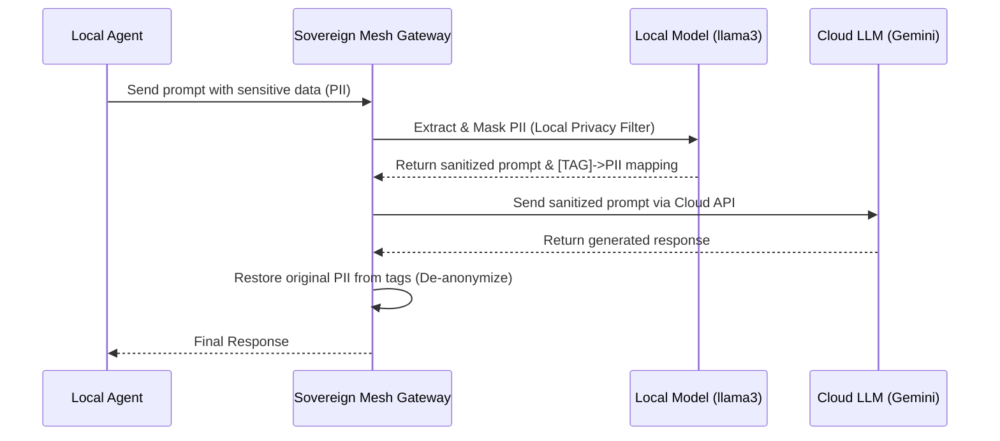

# Sovereign Mesh Gateway

A privacy-preserving local gateway that acts as a secure intermediary between your local environment and Cloud-based Large Language Models (LLMs). The gateway intercepts incoming prompts, uses a local small Language Model (via Ollama) to identify and redact Personally Identifiable Information (PII), and forwards the anonymized prompt to a cloud LLM (e.g., Gemini). The results are then securely mapped back.

## 🏗️ Agentic Architecture Diagram

This diagram visualizes the flow of data through the privacy mesh:



## 🚀 Features
- **Local Privacy Filter:** Uses local models to identify and extract PII before it ever hits the public internet.
- **Cloud LLM Routing:** Seamlessly sends the sanitized payload to Google's Gemini (or extensible to OpenAI/Anthropic).
- **Self-Healing Mappings:** Automatically replaces placeholders like `[NAME_1]` back into the final cloud response.
- **Container Ready:** Includes a `Dockerfile` for standardized serverless or edge deployments.

## 🛠️ Setup & Installation

### 1. Requirements
- Python 3.11+
- [Ollama](https://ollama.com/) running locally with `llama3` (`ollama run llama3`)
- A Gemini API Key (or other cloud keys)

### 2. Environment Setup

```bash
# Set your Gemini API key
export GEMINI_API_KEY="your-api-key-here"

# Set up virtual environment
python3 -m venv venv
source venv/bin/activate

# Install dependencies
pip install -r requirements.txt
```

### 3. Running the Gateway

You can either run the FastAPI server directly or via Docker:

**Directly:**
```bash
uvicorn app.main:app --host 0.0.0.0 --port 8000 --reload
```

**Via Docker:**
```bash
docker build -t sovereign-mesh .
docker run -p 8000:8000 -e GEMINI_API_KEY="your-api-key" sovereign-mesh
```

## 🧪 Usage Examples

Once the gateway is running (e.g., at `http://localhost:8000`), you can send prompts containing PII:

```bash
curl -X 'POST' \
  'http://localhost:8000/api/v1/generate' \
  -H 'Content-Type: application/json' \
  -d '{
  "prompt": "Summarize this profile: John Doe works at Acme Corp. His email is john.doe@email.com and phone is 555-0199.",
  "target_model": "gemini"
}'
```

Watch your server logs! You will see that the cloud LLM only ever receives a sanitized string similar to:
`"Summarize this profile: [NAME_1] works at Acme Corp. His email is [EMAIL_1] and phone is [PHONE_1]."`
